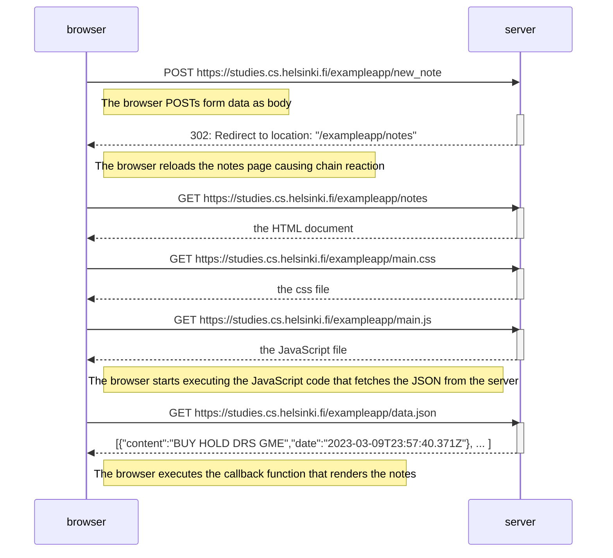

```mermaid
sequenceDiagram
   participant browser
   participant server
    
   browser->>server: POST https://studies.cs.helsinki.fi/exampleapp/new_note
   
   Note right of browser: The browser POSTs form data as body

   activate server
   server-->>browser: 302: Redirect to location: "/exampleapp/notes"
   deactivate server
   
   Note right of browser: The browser reloads the notes page causing chain reaction

   browser->>server: GET https://studies.cs.helsinki.fi/exampleapp/notes
   activate server
   server-->>browser: the HTML document
   deactivate server

   browser->>server: GET https://studies.cs.helsinki.fi/exampleapp/main.css
   activate server
   server-->>browser: the css file
   deactivate server
    
   browser->>server: GET https://studies.cs.helsinki.fi/exampleapp/main.js
   activate server
   server-->>browser: the JavaScript file
   deactivate server
    
   Note right of browser: The browser starts executing the JavaScript code that fetches the JSON from the server
    
   browser->>server: GET https://studies.cs.helsinki.fi/exampleapp/data.json
   activate server
   server-->>browser: [{"content":"BUY HOLD DRS GME","date":"2023-03-09T23:57:40.371Z"}, ... ]
   deactivate server

   Note right of browser: The browser executes the callback function that renders the notes
```